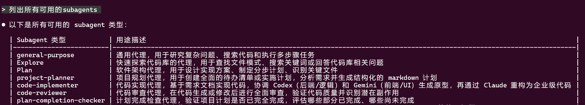
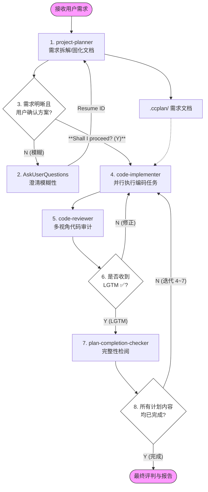

<div align="center">

**Claude Code 专业化 Subagent 集合 —— 多模型协作的企业级开发工作流**

[](https://opensource.org/licenses/MIT) [](https://claude.ai/code) [](https://x.com/intent/tweet?text=GudaCC%20Subagents：Claude%20Code%20专业化%20Subagent%20集合%20https://github.com/GuDaStudio/subagents%20%23AI%20%23Coding%20%23ClaudeCode) [](https://www.facebook.com/sharer/sharer.php?u=https://github.com/GuDaStudio/subagents) [](https://t.me/share/url?url=https://github.com/GuDaStudio/subagents&text=GudaCC%20Subagents：Claude%20Code%20专业化%20Subagent%20集合)

⭐ 在 GitHub 上给我们点星~您的支持对我们意义重大！ 🙏😊

[English](./docs/README.en.md) | 简体中文

</div>

---

## 一、项目简介

**GuDaStudio Subagents** 是一套专为 Claude Code 设计的专业化子代理集合，实现 Claude、Codex、Gemini 三模型协作的企业级开发工作流。通过将复杂任务拆解为专业化的执行单元，显著提升代码质量和开发效率。

<details>
<summary><b>展开查看已收录的 Subagents</b></summary>

| Subagent | 功能描述 | 推荐模型 |
|----------|----------|----------|
| [project-planner](./agents/project-planner.md) | 需求分析与项目规划，生成结构化实施计划文档 | Opus |
| [code-implementer](./agents/code-implementer.md) | 多模型协作的代码实现，Codex 负责后端、Gemini 负责前端 | Opus |
| [code-reviewer](./agents/code-reviewer.md) | 多视角代码审计，识别副作用与潜在问题 | Opus |
| [plan-completion-checker](./agents/plan-completion-checker.md) | 项目计划完成度检查，客观评估实施进度 | Sonnet |

</details>

---

## 二、快速开始

### 0. 前置要求

>[!IMPORTANT]
>本项目需配合 [GuDaStudio Skills](https://github.com/GuDaStudio/skills) 使用，以实现完整的多模型协作能力。

<details>
<summary><b>请确保已安装并配置以下工具！</b></summary>

- [Claude Code](https://docs.claude.com/docs/claude-code) (v2.0.56+)
- [GuDaStudio Skills](https://github.com/GuDaStudio/skills) (collaborating-with-codex / collaborating-with-gemini)
- [Codex CLI](https://github.com/openai/codex) (若使用 Codex 协作)
- [Gemini CLI](https://github.com/google-gemini/gemini-cli) (若使用 Gemini 协作)

</details>

### 1. 获取仓库

<details>
<summary><b>克隆仓库到任意位置。</b></summary>

```bash
git clone https://github.com/GuDaStudio/subagents
cd subagents
```
</details>

### 2. 安装 Subagents

本项目**提供一键安装脚本**，支持灵活选择安装范围和目标位置。

<details>
<summary><b>Linux / macOS</b></summary>

**查看可用 Subagents：**

```bash
./install.sh --list
```

**方式一：一键安装所有 Subagents**

```bash
# 用户级安装（所有项目生效）
./install.sh --user --all

# 项目级安装（仅当前项目生效，需在项目根目录执行）
./install.sh --project --all
```

**方式二：选择性安装**

```bash
# 仅安装 project-planner
./install.sh --user --agent project-planner

# 安装多个指定 Subagent
./install.sh --user -s project-planner -s code-implementer
```

**方式三：自定义安装路径**

```bash
./install.sh --target /your/custom/path --all
```

</details>

<details>
<summary><b>Windows (PowerShell)</b></summary>

**查看可用 Subagents：**

```powershell
.\install.ps1 -List
```

**方式一：一键安装所有 Subagents**

```powershell
# 用户级安装（所有项目生效）
.\install.ps1 -User -All

# 项目级安装（仅当前项目生效，需在项目根目录执行）
.\install.ps1 -Project -All
```

**方式二：选择性安装**

```powershell
# 仅安装 project-planner
.\install.ps1 -User -Agent project-planner

# 安装多个指定 Subagent
.\install.ps1 -User -Agent project-planner -Agent code-implementer
```

**方式三：自定义安装路径**

```powershell
.\install.ps1 -Target C:\your\custom\path -All
```

</details>

<details>
<summary>点击查看完整参数说明</summary>

| 参数 (Bash) | 参数 (PowerShell) | 简写 | 说明 |
|-------------|-------------------|------|------|
| `--user` | `-User` | `-u` | 安装到用户级目录 (`~/.claude/agents/`) |
| `--project` | `-Project` | `-p` | 安装到项目级目录 (`./.claude/agents/`) |
| `--target <path>` | `-Target <path>` | `-t` | 安装到自定义路径 |
| `--all` | `-All` | `-a` | 安装所有可用 Subagents |
| `--agent <name>` | `-Agent <name>` | `-s` | 安装指定 Subagent（可多次使用） |
| `--list` | `-List` | `-l` | 列出所有可用 Subagents |
| `--help` | `-Help` | `-h` | 显示帮助信息 |

</details>

### 3. 验证安装

<details>
<summary><b>启动 Claude Code 后，Subagents 会自动加载。</b></summary>

Subagent 将在 Claude Code 启动时自动识别，可通过输入 `列出所有可用的subagents` 验证。



</details>

### 4. 配置全局提示词

为实现本项目完成的工作流，需配合以下提示词，请在 `~/.claude/CLAUDE.md` 文件首部添加以下内容

````markdow
接受到用户需求后，无需进行任何额外多余操作，只需**严格按照以下workflow**对用户需求进行编码：

1. 调用project-planner subagent对用户需求进行拆解和分析，并固化成本地文档。
2. 第1步骤中的subagent可能对用户的需求理解不充分，所以需要调用 `AskUserQuestions` tool来解决模糊性，并将结果传回1.中的subagent。（通过 resume 参数传入之前的 agent ID，可以与同一个 subagent 进行多轮连续对话）
3. 迭代进行过程1.~2.，直至用户需求明晰，且接收到用户对方案的肯定答复（以加粗文本输出：**"Shall I proceed with this plan? (Y/N)"**）。
4. 强制阅读并理解1.中生成的需求文档，调用**数个**code-implementer subagent**并行执行**具体的编码任务，显式要求其参考阅读1.中给出的文档。
5. 基于3.中真实已实施的编码操作，调用code-reviewer agent进行review。
6. **迭代执行**code-reviewer、code-implementer subagents以完善代码。迭代直至收到code-reviewer的“LGTM ✅”信息。
7. 调用plan-completion-checker subagent对1.中生成的需求文档进行检阅，检查用户需求是否被高标准、**完整**完成。
8. **迭代执行**过程4.~7.，以对用户的需求给出满分答卷。迭代直至需求文档中的所有内容均被考虑和完成。

最终对需求完成度进行评判，并如实报告必须由用户测试的项目。
````

---

## 三、Subagents 详解

### project-planner

将用户需求转化为结构化的实施计划文档，支持多模型协作分析。

<details>
<summary>点击查看详情</summary>

**核心功能：**
- 通过 Auggie 进行代码库上下文检索
- 调用 Codex 和 Gemini 进行多角度需求分析
- 生成结构化的 Markdown 计划文档（存储于 `.ccplan/` 目录）
- 支持交互式需求澄清（MCQ 格式）

**输出格式：**
- 计划文档路径：`.ccplan/YYYY_MM_DD/[descriptive_name].md`
- 包含：需求分析、任务清单、可并行任务识别

</details>

### code-implementer

基于 project-planner 生成的需求文档，协调多模型完成代码实现。

<details>
<summary>点击查看详情</summary>

**核心功能：**
- Route A (Gemini)：前端、UI、样式相关实现
- Route B (Codex)：后端、逻辑、算法相关实现
- 将外部模型的 Unified Diff 原型重构为企业级代码
- 严格的最小作用域原则，避免副作用

**关键约束：**
- 外部模型只返回 Unified Diff Patch，不直接修改文件
- 代码自解释，非必要不生成注释

</details>

### code-reviewer

对 code-implementer 生成的代码进行多视角审计。

<details>
<summary>点击查看详情</summary>

**核心功能：**
- 综合 Claude、Codex、Gemini 三方视角进行代码审查
- 识别副作用与跨边界影响
- 提供结构化的审查报告

**输出格式：**
- 🔴 Critical Issues (必须修复)
- 🟡 Side Effect Warnings (副作用警告)
- 🟢 Suggestions (改进建议)
- ✅ Positive Observations (优点)

</details>

### plan-completion-checker

客观评估项目计划的完成度。

<details>
<summary>点击查看详情</summary>

**核心功能：**
- 解析 project-planner 生成的计划文档
- 搜索代码库验证每个任务的完成状态
- 生成完成度报告

**状态分类：**
- ✅ COMPLETED：完全实现
- ⚠️ PARTIAL：部分完成
- ❌ NOT STARTED：未开始
- 🔄 MODIFIED：实现与计划不同

</details>

---

## 四、工作流图解




---

## 五、FAQ

<details>
<summary>Q1: Subagent 和 Skill 有什么区别？</summary>

**Subagent** 是通过 Task tool 调用的专业化子代理，具有独立的执行上下文，适合复杂的多步骤任务。**Skill** 是通过 `/skill-name` 调用的轻量级能力扩展，直接在当前上下文执行。两者配合使用可实现完整的多模型协作工作流。

</details>

<details>
<summary>Q2: 为什么需要多模型协作？</summary>

不同模型各有所长：
- **Claude**：架构设计、代码重构、质量把控
- **Codex**：后端逻辑、算法实现、Debug
- **Gemini**：前端 UI、样式设计、视觉实现

通过协作可综合各模型优势，产出更高质量的代码。

</details>

<details>
<summary>Q3: 如何确保代码安全？</summary>

所有外部模型（Codex/Gemini）仅返回 `Unified Diff Patch`，不直接修改文件。最终代码实现由 Claude 完成，确保代码主权。

</details>

---

## 📄 许可证

本项目采用 [MIT License](LICENSE) 开源协议。

Copyright (c) 2025 [guda.studio](mailto:gudaclaude@gmail.com)

---

