<div align="center">

**Specialized Subagent Collection for Claude Code — Enterprise-Grade Development Workflow with Multi-Model Collaboration**

[](https://opensource.org/licenses/MIT) [](https://claude.ai/code) [](https://x.com/intent/tweet?text=GudaCC%20Subagents：Specialized%20Subagent%20Collection%20for%20Claude%20Code%20https://github.com/GuDaStudio/subagents%20%23AI%20%23Coding%20%23ClaudeCode) [](https://www.facebook.com/sharer/sharer.php?u=https://github.com/GuDaStudio/subagents) [](https://t.me/share/url?url=https://github.com/GuDaStudio/subagents&text=GudaCC%20Subagents：Specialized%20Subagent%20Collection%20for%20Claude%20Code)

Star us on GitHub — your support means a lot! 🙏😊

English | [简体中文](../README.md)

</div>

---

## 1. Introduction

**GuDaStudio Subagents** is a specialized subagent collection designed for Claude Code, enabling enterprise-grade development workflows through Claude, Codex, and Gemini multi-model collaboration. By decomposing complex tasks into specialized execution units, it significantly improves code quality and development efficiency.

<details>
<summary><b>View Available Subagents</b></summary>

| Subagent | Description | Recommended Model |
|----------|-------------|-------------------|
| [project-planner](../agents/project-planner.md) | Requirements analysis and project planning, generates structured implementation plan documents | Opus |
| [code-implementer](../agents/code-implementer.md) | Multi-model collaborative code implementation, Codex for backend, Gemini for frontend | Opus |
| [code-reviewer](../agents/code-reviewer.md) | Multi-perspective code audit, identifies side effects and potential issues | Opus |
| [plan-completion-checker](../agents/plan-completion-checker.md) | Project plan completion check, objectively evaluates implementation progress | Sonnet |

</details>

---

## 2. Quick Start

### 0. Prerequisites

>[!IMPORTANT]
>This project requires [GuDaStudio Skills](https://github.com/GuDaStudio/skills) to enable complete multi-model collaboration capabilities.

<details>
<summary><b>Please ensure the following tools are installed and configured!</b></summary>

- [Claude Code](https://docs.claude.com/docs/claude-code) (v2.0.56+)
- [GuDaStudio Skills](https://github.com/GuDaStudio/skills) (collaborating-with-codex / collaborating-with-gemini)
- [Codex CLI](https://github.com/openai/codex) (if using Codex collaboration)
- [Gemini CLI](https://github.com/google-gemini/gemini-cli) (if using Gemini collaboration)

</details>

### 1. Get the Repository

<details>
<summary><b>Clone the repository to any location.</b></summary>

```bash
git clone https://github.com/GuDaStudio/subagents
cd subagents
```
</details>

### 2. Install Subagents

This project **provides one-click installation scripts** with flexible installation scope and target location options.

<details>
<summary><b>Linux / macOS</b></summary>

**List available Subagents:**

```bash
./install.sh --list
```

**Option 1: Install all Subagents**

```bash
# User-level installation (applies to all projects)
./install.sh --user --all

# Project-level installation (applies to current project only, run from project root)
./install.sh --project --all
```

**Option 2: Selective installation**

```bash
# Install only project-planner
./install.sh --user --agent project-planner

# Install multiple specified Subagents
./install.sh --user -s project-planner -s code-implementer
```

**Option 3: Custom installation path**

```bash
./install.sh --target /your/custom/path --all
```

</details>

<details>
<summary><b>Windows (PowerShell)</b></summary>

**List available Subagents:**

```powershell
.\install.ps1 -List
```

**Option 1: Install all Subagents**

```powershell
# User-level installation (applies to all projects)
.\install.ps1 -User -All

# Project-level installation (applies to current project only, run from project root)
.\install.ps1 -Project -All
```

**Option 2: Selective installation**

```powershell
# Install only project-planner
.\install.ps1 -User -Agent project-planner

# Install multiple specified Subagents
.\install.ps1 -User -Agent project-planner -Agent code-implementer
```

**Option 3: Custom installation path**

```powershell
.\install.ps1 -Target C:\your\custom\path -All
```

</details>

<details>
<summary>Click to view complete parameter reference</summary>

| Parameter (Bash) | Parameter (PowerShell) | Short | Description |
|------------------|------------------------|-------|-------------|
| `--user` | `-User` | `-u` | Install to user-level directory (`~/.claude/agents/`) |
| `--project` | `-Project` | `-p` | Install to project-level directory (`./.claude/agents/`) |
| `--target <path>` | `-Target <path>` | `-t` | Install to custom path |
| `--all` | `-All` | `-a` | Install all available Subagents |
| `--agent <name>` | `-Agent <name>` | `-s` | Install specified Subagent (can be used multiple times) |
| `--list` | `-List` | `-l` | List all available Subagents |
| `--help` | `-Help` | `-h` | Show help information |

</details>

### 3. Verify Installation

<details>
<summary><b>Subagents will be automatically loaded when Claude Code starts.</b></summary>

Subagents will be automatically recognized when Claude Code starts. You can verify by typing `list all available subagents`.


</details>

### 4. Configure Global Prompt

To enable the complete workflow provided by this project, add the following content to the beginning of your `~/.claude/CLAUDE.md` file:

````markdown
After receiving user requirements, without any extra unnecessary operations, **strictly follow this workflow** to implement the user's requirements:

1. Call the project-planner subagent to decompose and analyze user requirements, and persist them as local documents.
2. The subagent in step 1 may not fully understand the user's requirements, so call the `AskUserQuestions` tool to resolve ambiguities, and pass the results back to the subagent in step 1. (Use the resume parameter with the previous agent ID to have multi-turn continuous conversations with the same subagent)
3. Iterate steps 1-2 until user requirements are clear and you receive the user's affirmative response to the plan (output in bold: **"Shall I proceed with this plan? (Y/N)"**).
4. Mandatorily read and understand the requirements document generated in step 1, call **multiple** code-implementer subagents to **execute in parallel** specific coding tasks, explicitly requiring them to reference and read the document from step 1.
5. Based on the actual coding operations implemented in step 3, call the code-reviewer agent for review.
6. **Iteratively execute** code-reviewer and code-implementer subagents to refine the code. Iterate until receiving "LGTM ✅" from code-reviewer.
7. Call the plan-completion-checker subagent to review the requirements document generated in step 1, checking whether user requirements have been completed to high standards and **completely**.
8. **Iteratively execute** steps 4-7 to deliver a perfect answer to user requirements. Iterate until all content in the requirements document has been considered and completed.

Finally, evaluate the requirement completion and honestly report items that must be tested by the user.
````

---

## 3. Subagents Deep Dive

### project-planner

Transforms user requirements into structured implementation plan documents, supporting multi-model collaborative analysis.

<details>
<summary>Click to view details</summary>

**Core Features:**
- Codebase context retrieval through Auggie
- Multi-perspective requirements analysis via Codex and Gemini
- Generates structured Markdown plan documents (stored in `.ccplan/` directory)
- Supports interactive requirements clarification (MCQ format)

**Output Format:**
- Plan document path: `.ccplan/YYYY_MM_DD/[descriptive_name].md`
- Includes: Requirements analysis, task list, parallelizable task identification

</details>

### code-implementer

Coordinates multi-model code implementation based on requirements documents generated by project-planner.

<details>
<summary>Click to view details</summary>

**Core Features:**
- Route A (Gemini): Frontend, UI, styling related implementation
- Route B (Codex): Backend, logic, algorithm related implementation
- Refactors Unified Diff prototypes from external models into enterprise-grade code
- Strict minimum scope principle to avoid side effects

**Key Constraints:**
- External models only return Unified Diff Patches, no direct file modifications
- Self-documenting code, no unnecessary comments

</details>

### code-reviewer

Performs multi-perspective audits on code generated by code-implementer.

<details>
<summary>Click to view details</summary>

**Core Features:**
- Comprehensive code review from Claude, Codex, and Gemini perspectives
- Identifies side effects and cross-boundary impacts
- Provides structured review reports

**Output Format:**
- 🔴 Critical Issues (must fix)
- 🟡 Side Effect Warnings
- 🟢 Suggestions (improvements)
- ✅ Positive Observations

</details>

### plan-completion-checker

Objectively evaluates project plan completion status.

<details>
<summary>Click to view details</summary>

**Core Features:**
- Parses plan documents generated by project-planner
- Searches codebase to verify completion status of each task
- Generates completion reports

**Status Categories:**
- ✅ COMPLETED: Fully implemented
- ⚠️ PARTIAL: Partially completed
- ❌ NOT STARTED: Not started
- 🔄 MODIFIED: Implementation differs from plan

</details>

---

## 4. Workflow Diagram

```dot
digraph Workflow {
    rankdir=TB;
    splines=ortho;
    nodesep=0.6;
    ranksep=0.6;
    fontname="Helvetica, Arial, sans-serif";

    // Default node style
    node [shape=box, style="filled,rounded", fontname="Helvetica, Arial, sans-serif", fontsize=10, penwidth=1.5];
    // Default edge style
    edge [fontname="Helvetica, Arial, sans-serif", fontsize=9, color="#555555"];

    // Color definitions
    // Start/End
    node [fillcolor="#E0E0E0", color="#9E9E9E"] Start End;
    // Subagents Colors
    node [fillcolor="#E3F2FD", color="#2196F3"] Planner;    // Blue
    node [fillcolor="#E8F5E9", color="#4CAF50"] Implementer; // Green
    node [fillcolor="#FFF3E0", color="#FF9800"] Reviewer;    // Orange
    node [fillcolor="#F3E5F5", color="#9C27B0"] Checker;     // Purple
    // Tools/Actions
    node [fillcolor="#FFFFFF", color="#607D8B", shape=note] Doc;
    node [fillcolor="#FFF8E1", color="#FFC107", shape=component] AskTool;
    // Decisions
    node [fillcolor="#FFFFFF", color="#333333", shape=diamond, style="filled"] DecisionPlan DecisionReview DecisionComplete;

    // --- Node Definitions ---

    Start [label="Receive User Requirements\n(Start)", shape=ellipse];

    subgraph cluster_planning {
        label="Phase 1: Requirements Planning & Analysis";
        style=dashed;
        color="#BDBDBD";
        fontcolor="#757575";

        Planner [label="1. project-planner Subagent\n(Decompose requirements/Local docs)\n[Auggie/Codex/Gemini]"];
        Doc [label="Requirements Document\n(.ccplan/*.md)"];
        AskTool [label="2. Tool: AskUserQuestions\n(Resolve ambiguities)"];
        DecisionPlan [label="3. Requirements clear?\nUser confirmed plan (Y)?"];
    }

    subgraph cluster_execution {
        label="Phase 2: Coding & Review (Iterative)";
        style=dashed;
        color="#BDBDBD";
        fontcolor="#757575";

        Implementer [label="4. code-implementer Subagents\n(Multiple Agents in Parallel)\n[Mandatory doc reading]", shape=folder];
        Reviewer [label="5. code-reviewer Subagent\n(Multi-perspective Audit/Diff Review)\n[Claude/Codex/Gemini]"];
        DecisionReview [label="6. Review passed?\n(LGTM ✅)"];
    }

    subgraph cluster_verification {
        label="Phase 3: Completeness Check";
        style=dashed;
        color="#BDBDBD";
        fontcolor="#757575";

        Checker [label="7. plan-completion-checker\n(Compare docs for completion)"];
        DecisionComplete [label="8. All requirements done?\n(Full Coverage)"];
    }

    End [label="Final Evaluation & Report\n(Report items requiring user testing)", shape=ellipse];

    // --- Connection Logic ---

    // 1. Planning phase
    Start -> Planner;
    Planner -> Doc [style=dotted, label="generates"];
    Doc -> Planner [style=dotted, label="context"];

    Planner -> DecisionPlan;

    // Loop 1: Requirements clarification
    DecisionPlan -> AskTool [label="N: Ambiguous/Unconfirmed"];
    AskTool -> Planner [label="Resume w/ Info\n(Same ID multi-turn)"];

    // 2. Enter implementation
    DecisionPlan -> Implementer [label="Y: Proceed (bold)", penwidth=2.0];
    Doc -> Implementer [style=dotted, label="as reference input"];

    // 3. Implementation and review loop
    Implementer -> Reviewer [label="Submit code"];
    Reviewer -> DecisionReview;

    // Loop 2: Code correction
    DecisionReview -> Implementer [label="N: Issues/Suggestions", color="#D32F2F"];

    // 4. Completeness check
    DecisionReview -> Checker [label="Y: LGTM ✅", color="#388E3C"];
    Checker -> DecisionComplete;

    // Loop 3: Complete unfinished requirements (back to implementation)
    DecisionComplete -> Implementer [label="N: Partial/Below standard\n(Iterate steps 4-7)", color="#D32F2F"];

    // 5. End
    DecisionComplete -> End [label="Y: Perfect delivery", penwidth=2.0, color="#388E3C"];
}

```



---

## 5. FAQ

<details>
<summary>Q1: What's the difference between Subagent and Skill?</summary>

**Subagent** is a specialized sub-agent invoked via the Task tool, with an independent execution context, suitable for complex multi-step tasks. **Skill** is a lightweight capability extension invoked via `/skill-name`, executed directly in the current context. Using both together enables the complete multi-model collaboration workflow.

</details>

<details>
<summary>Q2: Why is multi-model collaboration needed?</summary>

Different models have different strengths:
- **Claude**: Architecture design, code refactoring, quality control
- **Codex**: Backend logic, algorithm implementation, debugging
- **Gemini**: Frontend UI, styling design, visual implementation

Through collaboration, the strengths of each model are combined to produce higher quality code.

</details>

<details>
<summary>Q3: How is code security ensured?</summary>

All external models (Codex/Gemini) only return `Unified Diff Patches` and do not directly modify files. Final code implementation is completed by Claude, ensuring code sovereignty.

</details>

---

## 📄 License

This project is open-sourced under the [MIT License](../LICENSE).

Copyright (c) 2025 [guda.studio](mailto:gudaclaude@gmail.com)
